# seoul-bike-aarrr-analysis
# 서울시 따릉이 AARRR 퍼널 및 운영 효율 분석

## 1. 프로젝트 개요

본 프로젝트는 서울시 공공자전거 **따릉이**의 월별 공개데이터를 기반으로, 신규가입 → 정기권 이용 전환 → 지속 이용 흐름을 분석하고, 대여소별 수요-공급 불균형을 함께 진단한 데이터 분석 프로젝트이다.

분석은 크게 두 축으로 구성하였다.

1. **Growth Analysis**: 신규가입, 정기권 이용 전환, 지속 이용 흐름을 성별·연령대·월별로 분석하였다.
2. **Station Operation Efficiency Analysis**: 대여소별 이용량, 거치대 대비 이용효율, 과수요·저활용 후보를 식별하여 운영 개선 방향을 도출하였다.

즉, 본 프로젝트는 단순히 이용량이 많은 구간을 찾는 데 그치지 않고, **정기권 비중, 가입자당 이용, 거치대 대비 효율로 성장과 운영을 함께 봤다.**

---

## 2. 문제 정의

> 따릉이 신규가입 증가가 실제 정기권 이용 및 지속 이용으로 충분히 이어지지 않는 세그먼트와, 대여소별 수요-공급 불균형이 발생하는 지점을 식별하여 마케팅 및 운영 최적화 의사결정을 지원한다.

본 프로젝트의 핵심 질문은 다음과 같다.

### Growth 관점

- 신규가입은 언제, 어떤 성별·연령대에서 많이 발생하는가?
- 신규가입이 정기권 이용으로 잘 이어지는가?
- 정기권 이용은 월별로 지속되는가?
- 어떤 세그먼트가 유입은 많지만 전환 또는 지속 이용이 약한가?

### Operation 관점

- 이용 수요는 어떤 대여소와 권역에 집중되는가?
- 거치대 수 대비 이용량이 과도하게 높은 대여소는 어디인가?
- 반복적으로 과수요 또는 저활용 상태인 대여소는 어디인가?
- 자치구별 운영 효율과 수요-공급 불균형은 어떻게 다른가?

---

## 3. 분석상 핵심 제약

공개데이터에는 개인 사용자를 식별할 수 있는 `user_id`가 포함되어 있지 않다. 따라서 개인 단위로 가입 후 첫 이용 여부, 재방문 여부, 이탈 여부를 직접 추적할 수 없다.

이 한계를 보완하기 위해 본 프로젝트에서는 다음과 같이 **proxy metric**을 설계했다.

| 분석 단계 | 직접 계산하고 싶었던 지표 | 공개데이터 한계 | 대체 지표 |
|---|---|---|---|
| Activation | 가입 후 첫 정기권 이용률 | 개인별 가입일·첫 이용일 없음 | 동일 월 정기권 이용건수 / 동일 월 신규가입자 수 |
| Retention | 가입자 또는 이용자 개인 잔존율 | user_id 없음 | 이번 달 정기권 이용건수 / 전월 정기권 이용건수 |
| Operation | 실제 자전거 부족·반납 실패 | 실시간 재고·반납 실패 데이터 없음 | 이용건수 / 거치대 수 |

따라서 본 프로젝트의 Activation과 Retention은 실제 개인 단위 전환율·잔존율이 아니라, **월 × 성별 × 연령대 집계 단위의 정기권 이용 강도와 지속성 proxy**로 해석해야 한다.

---

## 4. 데이터 및 분석 단위

본 분석은 서울시 따릉이 월별 공개데이터를 기반으로 진행하였다.

분석 기간은 **2024년 1월부터 2025년 12월까지 24개월**이다.

| 구분 | 분석 단위 | 주요 내용 |
|---|---|---|
| 신규가입 데이터 | 월 × 성별 × 연령대 | 신규가입자 수 |
| 이용 데이터 | 월 × 성별 × 연령대 × 이용권 유형 | 전체 이용건수, 정기권 이용건수 |
| 대여소 이용 데이터 | 월 × 대여소 | 대여소별 이용건수, 이동거리, 이용시간 |
| 대여소 스냅샷 데이터 | 대여소 | 대여소명, 자치구, 좌표, 거치대 수 |

분석 grain은 다음과 통일하였다.

| 분석 영역 | 기준 grain |
|---|---|
| Acquisition | 월 × 성별 × 연령대 |
| Activation | 월 × 성별 × 연령대 |
| Retention | 월 × 성별 × 연령대 |
| Station Operation | 월 × 대여소 |
| District Operation | 자치구 × 대여소 요약 |

---

## 5. 데이터 파이프라인

데이터는 다음 흐름으로 정리하였다.

```text
RAW DATA
  ├─ raw_signup_month
  ├─ raw_ride_month
  ├─ raw_station_usage_month
  └─ raw_station_snapshot
        ↓
STAGING TABLE
  ├─ stg_signup_month
  ├─ stg_ride_month
  ├─ stg_station_usage_month
  ├─ stg_station_snapshot
  └─ stg_month_station_snapshot_map
        ↓
MART TABLE
  ├─ mart_growth_month
  └─ mart_station_efficiency_month
        ↓
ANALYSIS
  ├─ Acquisition
  ├─ Activation
  ├─ Retention
  └─ Station Operation Efficiency
```

### 주요 전처리 내용

- 월 기준 컬럼을 `month_ym`, `month_date`로 통일
- 성별 값을 `M`, `F`, `UNKNOWN`으로 표준화
- 연령대 결측 또는 미입력 값을 `UNKNOWN` 또는 분석 제외 대상으로 관리
- 이용권 유형을 `SUBSCRIPTION`, `NON_SUBSCRIPTION`으로 단순화
- 대여소명에서 `station_id`와 `station_name` 분리
- 운영 방식별 LCD/QR 거치대 수를 통합하여 `rack_cnt` 생성
- 월별 대여소 이용 데이터와 반기별 대여소 스냅샷을 매핑
- raw → stg → mart 단계마다 기간, null, 음수값, 표준화 결과를 점검

최종 분석에서는 주로 다음 mart 테이블을 사용하였다.

| 테이블 | 설명 |
|---|---|
| `mart_growth_month` | 월·성별·연령대 단위 신규가입 및 정기권 이용 지표 |
| `mart_station_efficiency_month` | 월·대여소 단위 이용량, 정기권 비중, 거치대 대비 효율 지표 |

---

## 6. 핵심 지표 설계

### 6.1 Acquisition

| 지표 | 계산식 | 의미 |
|---|---|---|
| `signup_cnt` | 월별 신규가입자 수 | 신규 유입 규모 |
| `signup_share` | 세그먼트 신규가입자 수 / 전체 신규가입자 수 | 신규 유입 기여도 |

### 6.2 Activation

| 지표 | 계산식 | 의미 |
|---|---|---|
| `activation_proxy` | 동일 월 정기권 이용건수 / 동일 월 신규가입자 수 | 신규가입 규모 대비 정기권 이용 강도 |
| `subscription_share` | 정기권 이용건수 / 전체 이용건수 | 전체 이용 중 정기권 중심성 |
| `sub_ride_share` | 세그먼트 정기권 이용건수 / 전체 정기권 이용건수 | 정기권 이용 기여도 |
| `sub_vs_signup_share_gap` | 정기권 이용 비중 - 신규가입 비중 | 가입 대비 정기권 이용이 강한 세그먼트 식별 |

`activation_proxy`는 실제 “가입 후 첫 이용률”이 아니다. 공개데이터에는 개인별 가입일과 첫 이용일이 없기 때문에, 동일 월 신규가입 규모 대비 정기권 이용건수를 활용해 신규가입자의 정기권 이용 연결 강도를 proxy로 설계하였다.

### 6.3 Retention

| 지표 | 계산식 | 의미 |
|---|---|---|
| `retention_proxy_mom` | 이번 달 정기권 이용건수 / 전월 정기권 이용건수 | 전월 대비 정기권 이용 지속성 |
| `rolling_3m_persistence` | 이번 달 정기권 이용건수 / 직전 3개월 평균 정기권 이용건수 | 최근 평균 대비 지속 이용 강도 |

`retention_proxy_mom`이 1보다 크면 전월보다 정기권 이용이 증가한 것이고, 1보다 작으면 전월보다 정기권 이용이 감소한 것이다.

### 6.4 Station Operation

| 지표 | 계산식 | 의미 |
|---|---|---|
| `total_ride_cnt` | 대여소별 전체 이용건수 | 절대 수요 규모 |
| `avg_monthly_ride_cnt` | 월평균 이용건수 | 평균 수요 규모 |
| `avg_rack_cnt` | 평균 거치대 수 | 공급 규모 |
| `avg_monthly_rides_per_rack` | 월평균 이용건수 / 평균 거치대 수 | 거치대 대비 이용효율 |
| `period_rides_per_rack` | 전체 기간 이용건수 / 평균 거치대 수 | 기간 전체 기준 공급 대비 총 수요 |
| `over_demand_station_share_pct` | 과수요 후보 수 / 자치구 대여소 수 | 자치구 내부 과수요 집중도 |
| `under_use_station_share_pct` | 저활용 후보 수 / 자치구 대여소 수 | 자치구 내부 저활용 집중도 |

운영 효율 분석에서는 단순 이용량뿐 아니라 거치대 대비 이용효율을 함께 보았다. 이용량이 많은 대여소라도 거치대 수가 충분하면 운영 부담이 상대적으로 낮을 수 있고, 반대로 이용량이 중간 수준이어도 거치대 수가 적으면 운영 병목 가능성이 높을 수 있기 때문이다.

---

## 7. 분석 결과 요약

## 7.1 Acquisition

Acquisition 분석에서는 월별 신규가입 추이와 성별·연령대별 신규가입 규모를 확인하였다.

<p align="center">
  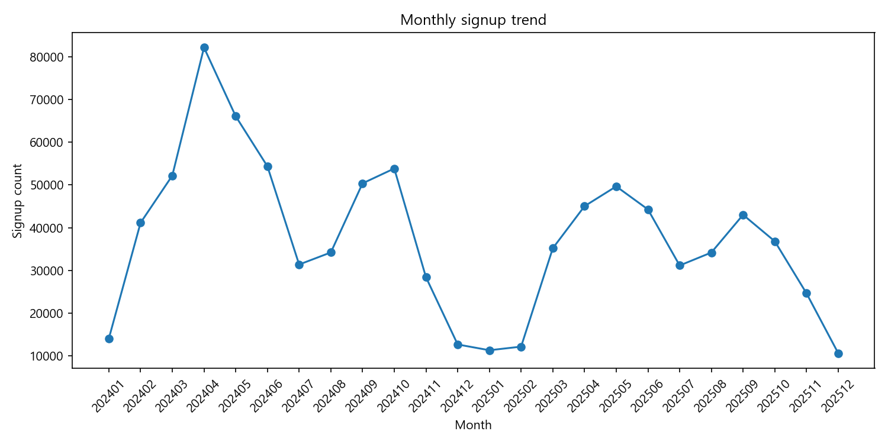
  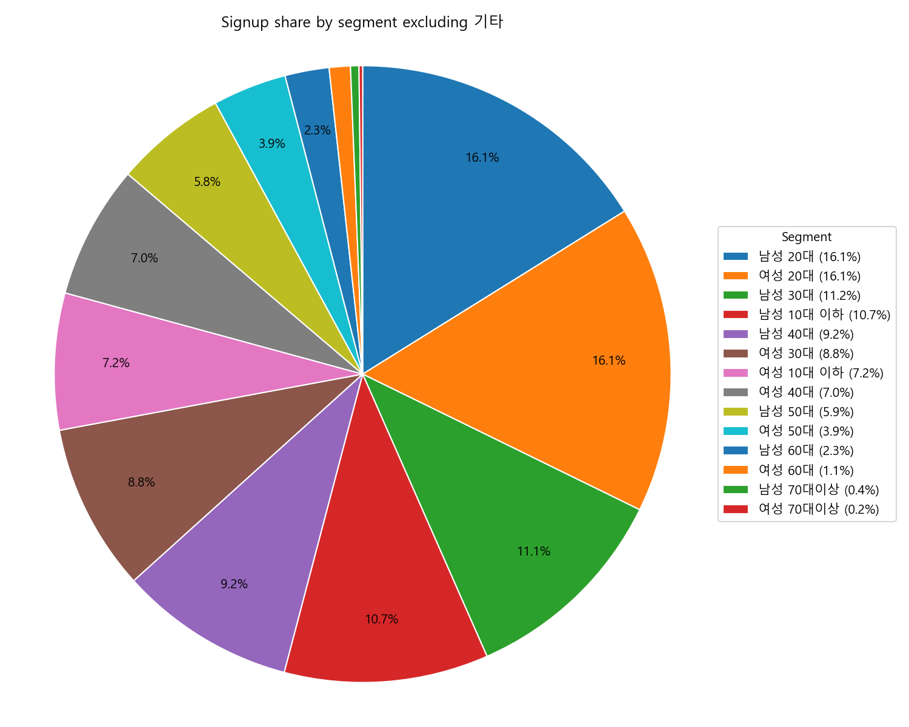
</p>

<p align="center">
  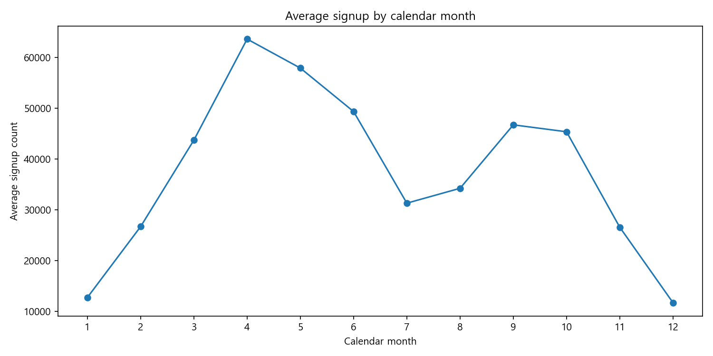
</p>

신규가입은 3\~5월 봄철에 크게 증가하고, 11\~12월 및 겨울철에는 감소하는 계절성을 보였다. 성별·연령대 기준으로는 **20대 남성과 20대 여성**이 전체 신규가입의 핵심 유입층으로 나타났다.

즉, 따릉이의 신규가입은 날씨와 생활 패턴의 영향을 크게 받으며, 20대를 중심으로 유입이 형성되는 구조로 해석된다.

---

## 7.2 Activation Analysis

Activation 분석에서는 신규가입이 정기권 이용으로 얼마나 연결되는지 확인하였다.

<p align="center">
  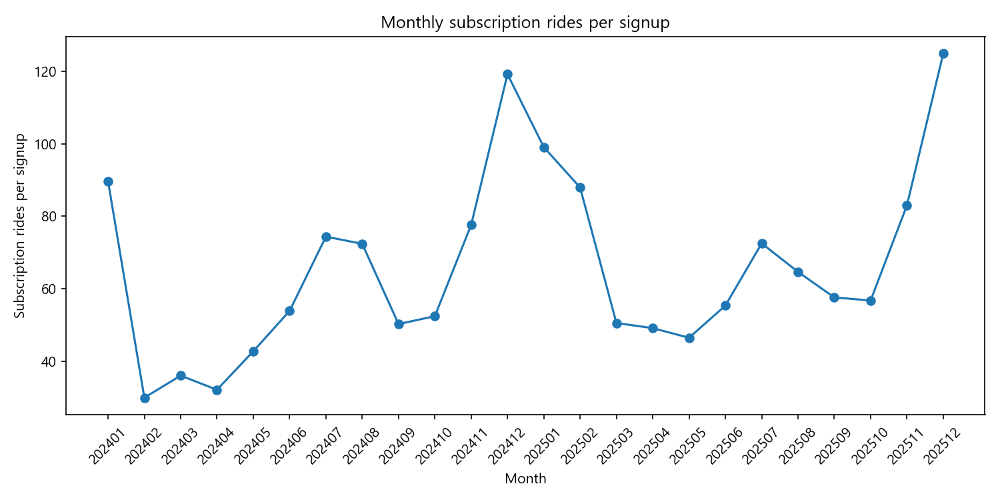
  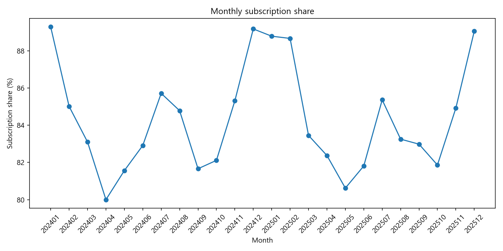
</p>

<p align="center">
  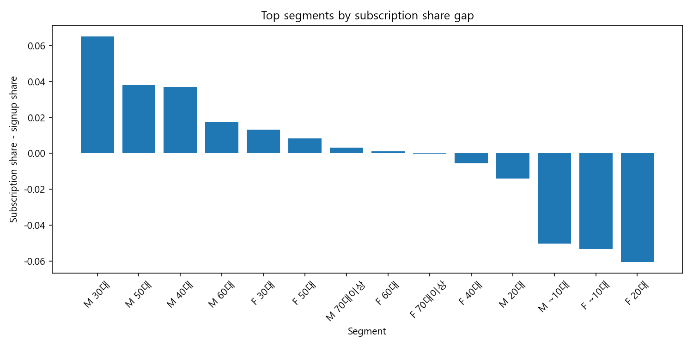
  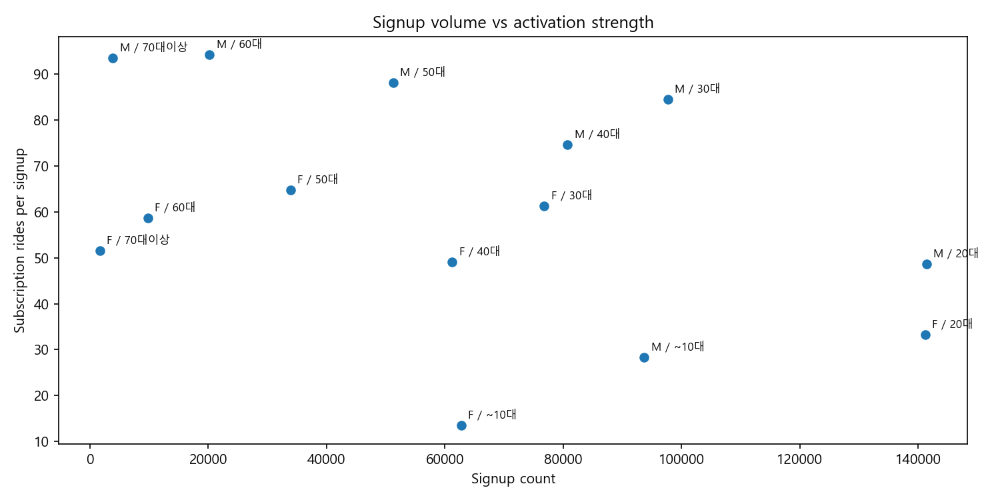
</p>

20대는 신규가입 규모가 크지만, 정기권 이용 비중은 신규가입 비중에 비해 낮게 나타났다. 특히 여성 20대와 10대 이하 세그먼트는 가입 대비 정기권 이용 강도가 낮아 온보딩 개선 후보로 볼 수 있다. 따라서 20대는 Acquisition은 강하지만 Activation이 약한 세그먼트로 볼 수 있으며, 신규가입 직후 정기권 이용을 유도하는 온보딩 전략이 필요하다.

**남성 30대**는 신규가입 규모와 정기권 이용 강도를 모두 갖춘 핵심 Activation 세그먼트로 나타났다. 남성 40~50대도 정기권 중심 반복 이용 성격이 강했고, 남성 60대 이상은 규모는 작지만 가입 대비 정기권 이용 강도가 높은 고효율 세그먼트로 해석된다.

또한, 봄철에는 신규가입이 크게 증가하지만 Activation proxy는 상대적으로 낮아, 가입 증가가 곧바로 강한 정기권 이용으로 이어지지는 않았다.

---

## 7.3 Retention Analysis

Retention 분석에서는 정기권 이용이 월별로 지속되는 흐름을 확인하였다.

<p align="center">
  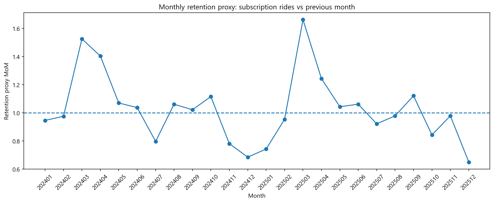
  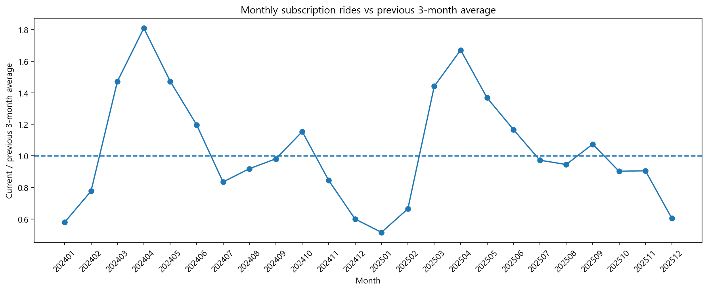
</p>

<p align="center">
  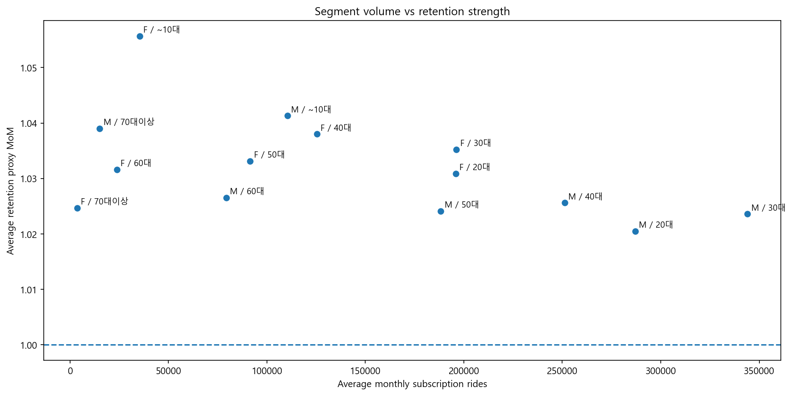
  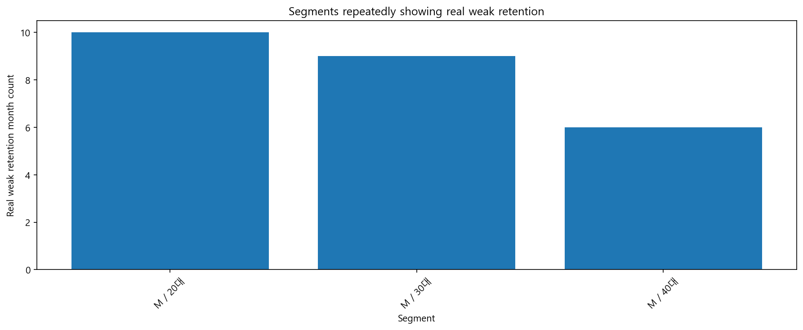
</p>

정기권 이용은 3\~6월에 전월 대비 증가하며 봄철 회복 흐름을 보였다. 반면 11\~2월에는 정기권 이용 유지가 약화되는 경향이 나타났다.

성별·연령대별로는 남성 30~50대가 규모와 지속성 측면에서 안정적인 핵심 세그먼트로 나타났으며, 남성 고연령층은 규모는 작지만 정기권 중심 반복 이용 성향이 강했다. 20대 남성은 봄철 회복 흐름에는 동참하지만 평균 대비 Retention 강도가 높지는 않았고, 겨울철에는 유지력이 약해지는 경향을 보였다.

Retention은 개인 단위 이탈률이 아니라 월별 정기권 이용 흐름의 proxy이다. 따라서 결과 해석에서는 개별 사용자가 이탈했다가 아니라 해당 세그먼트의 정기권 이용 규모가 전월 대비 약화되었다로 표현하였다.

---

## 7.4 Station Operation Efficiency Analysis

운영 효율 분석에서는 대여소별 총 이용건수, 거치대 대비 이용효율, 과수요·저활용 후보를 확인하였다.

<p align="center">
  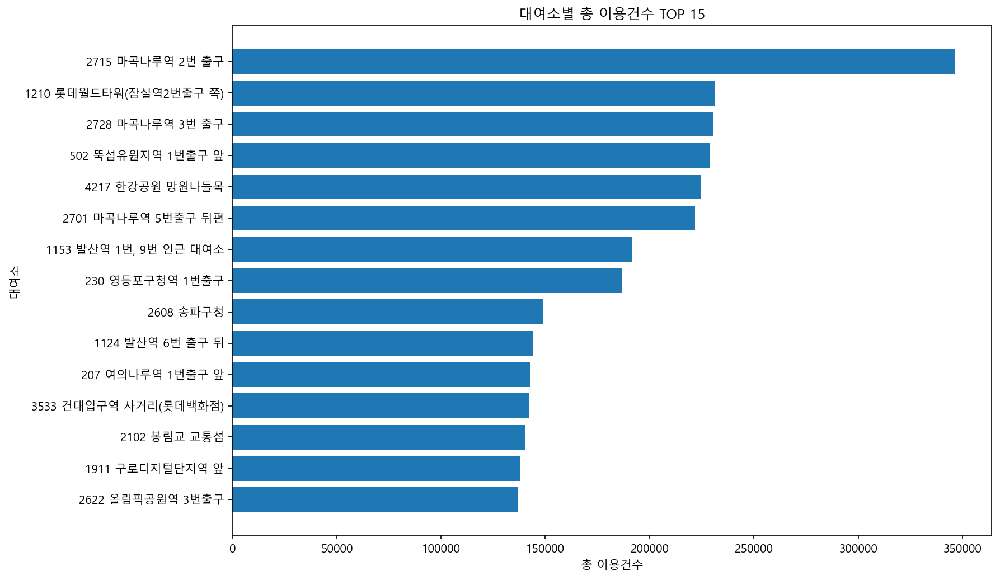
  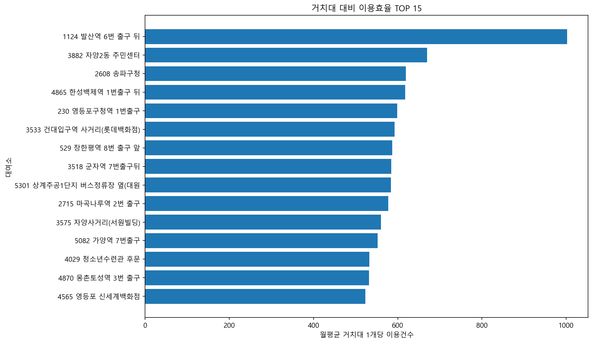
</p>

<p align="center">
  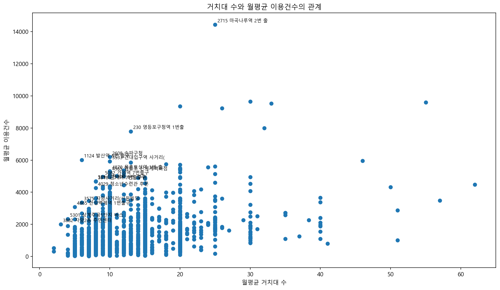
  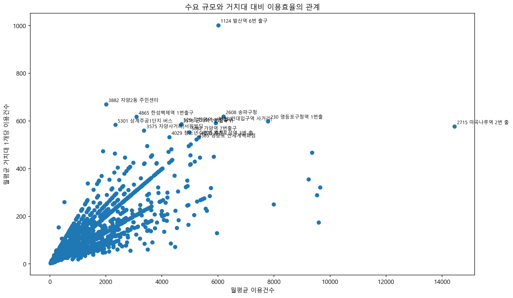
</p>

총 이용건수는 지하철역, 업무·상업지구, 한강공원 접근 지점, 대형 생활 거점에 집중되었다. 

- 절대 수요 상위 대여소 예시: `마곡나루역 2번 출구`, `롯데월드타워(잠실역2번출구 쪽)`, `마곡나루역 3번 출구`
- 거치대 대비 이용효율 상위 대여소 예시: `발산역 6번 출구 뒤`, `송파구청`, `영등포구청역 1번출구`, `건대입구역 사거리`

4분위 기준은 과수요·저활용 후보를 넓게 탐색하는 1차 스크리닝으로 활용했고, 10분위 기준은 실제 운영 점검 우선순위에 가까운 핵심 후보를 식별하는 데 활용했다.

10분위 기준 결과는 다음과 같다.

- 10분위 기준으로 핵심 과수요/운영 병목 후보는 164개, 핵심 저활용 후보는 218개로 나타났다.
- 월별 반복 기준까지 적용하면 24개월 내내 과수요 조건을 만족한 대여소는 86개, 24개월 내내 저활용 조건을 만족한 대여소는 78개로 좁혀졌다.

| 구분 | 대여소 수 |
|---|---:|
| 일반 | 2,173개 |
| 핵심 과수요/운영 병목 후보 | 164개 |
| 핵심 저활용 후보 | 218개 |
| 24개월 내내 과수요 조건 만족 | 86개 |
| 24개월 내내 저활용 조건 만족 | 78개 |

<p align="center">
  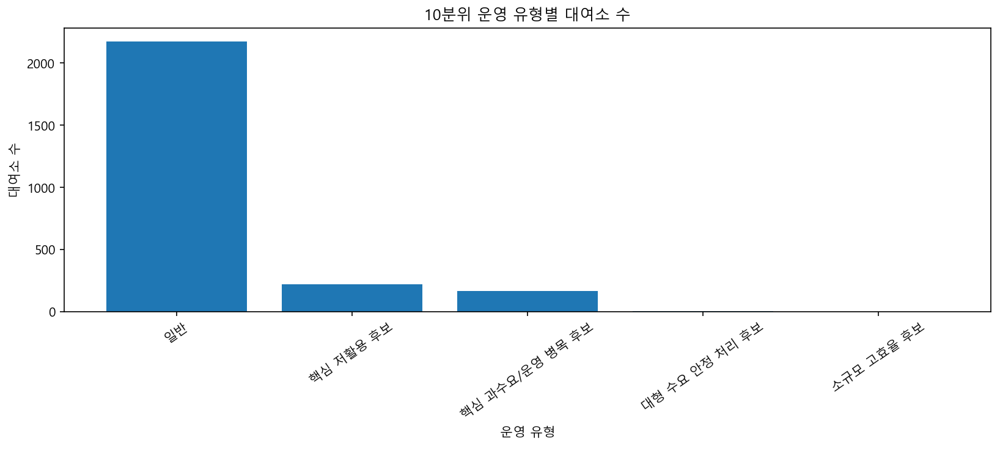
  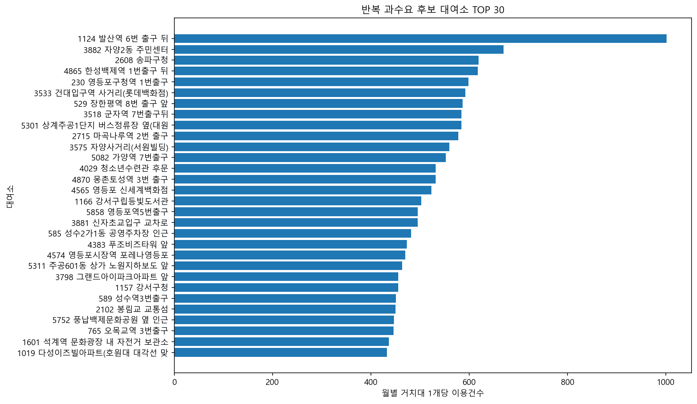
</p>

<p align="center">
  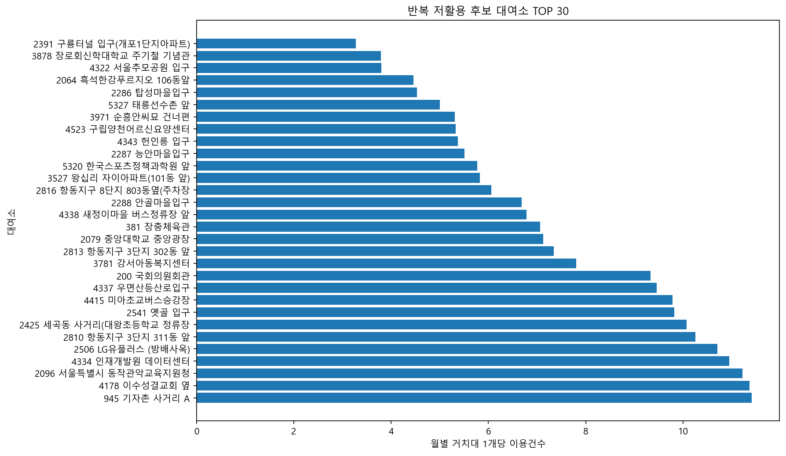
</p>

대여소 위치 기반 결과는 HTML 지도로도 저장하였다.

- [총 이용건수 상위 대여소 지도](images/station_operation_efficiency/01_top30_station_by_total_rides_map.html)
- [거치대 대비 이용효율 상위 대여소 지도](images/station_operation_efficiency/02_top30_station_by_avg_monthly_rides_per_rack_map.html)
- [10분위 기준 24개월 반복 과수요 대여소 지도](images/station_operation_efficiency/09_10tile_repeated_over_demand_map.html)
- [10분위 기준 24개월 반복 저활용 대여소 지도](images/station_operation_efficiency/09_10tile_repeated_under_use_map.html)

이 결과는 따릉이 운영에서 과수요와 저활용이 동시에 존재하며, 일부 대여소에서는 수요-공급 불균형이 장기간 반복되고 있음을 보여준다.과수요 후보는 단순 이용량이 많은 대여소뿐 아니라, 거치대 수 대비 이용 압력이 큰 대여소까지 함께 고려해야 한다.

---

## 7.5 District Operation Analysis

자치구별 운영 효율 분석에서는 대여소 단위 과수요·저활용 후보를 자치구별로 집계하였다.

<p align="center">
  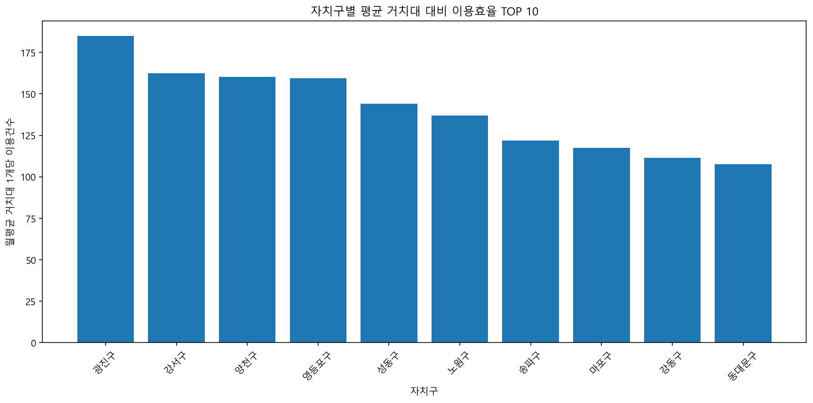
</p>

<p align="center">
  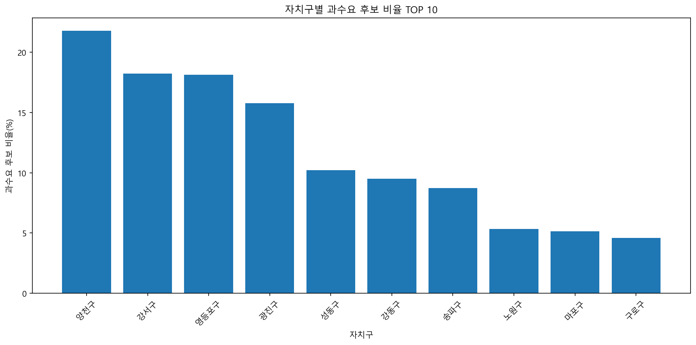
  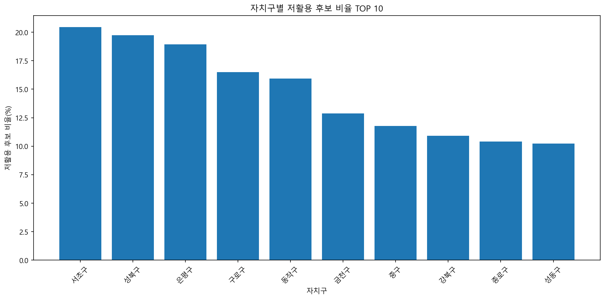
</p>

- 월평균 거치대 1개당 이용건수는 광진구, 영등포구, 양천구, 강서구, 성동구 순으로 높았다.
- 강서구는 과수요 후보 수가 많고 과수요 후보 비율도 높아 절대적인 운영 부담이 큰 지역으로 나타났다.
- 양천구는 과수요 후보 비율이 가장 높아 자치구 내부에서 공급 대비 이용 압력이 가장 집중된 지역으로 해석된다.
- 서초구, 은평구, 구로구, 동작구, 용산구는 저활용 후보 비율이 높아 일부 대여소의 입지 적합성이나 공급 규모 점검이 필요하다.

자치구별 운영 효율 개선은 과수요 후보 수와 후보 비율을 함께 고려해야 한다. 후보 수는 운영 대상의 절대 규모를 보여주고, 후보 비율은 자치구 내부에서 과수요 또는 저활용이 얼마나 집중되어 있는지를 보여준다.

---

## 8. 핵심 인사이트

### Insight 1. 신규가입은 20대 중심이지만 정기권 이용 전환은 상대적으로 약하다

20대 남성과 20대 여성은 전체 신규가입의 핵심 유입층으로 나타났다. 그러나 20대는 신규가입 비중에 비해 정기권 이용 비중과 가입자당 정기권 이용 강도가 낮아, 유입 이후 반복 이용으로 충분히 전환되지 않는 세그먼트로 해석된다.

### Insight 2. 봄철 신규가입 증가는 강하지만 Activation 강화가 필요하다

신규가입은 3~5월에 크게 증가하지만, 해당 시기의 Activation proxy는 상대적으로 낮게 나타났다. 이는 봄철 가입 증가가 곧바로 강한 정기권 이용으로 연결되지 않음을 의미한다.

### Insight 3. 남성 30대와 중장년 남성층은 정기권 반복 이용의 핵심 세그먼트다

남성 30대는 신규가입 규모와 정기권 이용 강도를 모두 갖춘 핵심 세그먼트이다. 남성 50대 이상은 가입 규모는 작지만 정기권 비중과 반복 이용 성향이 높아 고효율 세그먼트로 볼 수 있다.

### Insight 4. Retention은 봄철에 회복되고 겨울철에 약화된다

정기권 이용은 3\~6월에 회복되지만, 11\~2월에는 전반적으로 약화된다. 따라서 비수기에는 이용 감소를 완화하기 위한 Retention 전략이 필요하다.

### Insight 5. 과수요와 저활용이 동시에 존재하며 권역별 편차가 크다

운영 효율 분석 결과, 일부 대여소와 권역에서는 구조적 과수요가 반복되는 반면, 다른 일부 대여소에서는 구조적 저활용이 지속되었다. 과수요는 강서구 마곡·발산, 영등포·양천, 성동·광진·송파 권역에 집중되는 경향을 보였다.

---

## 9. 액션 아이템

### Action 1. 20대 신규가입자의 정기권 첫 이용을 유도한다

20대는 신규가입 규모가 크지만 정기권 이용 전환이 약하므로, 가입 직후 정기권 첫 이용을 유도하는 온보딩이 필요하다.

예시 액션:

- 가입 후 7일 내 첫 정기권 이용 리마인드
- 대학가·역세권 중심 정기권 이용 안내
- 신규가입자 대상 첫 정기권 이용 쿠폰
- 출퇴근·통학 목적별 이용 가이드 제공

### Action 2. 봄철 신규가입 성수기를 Activation 강화 기간으로 운영한다

3~5월은 신규가입이 집중되는 시기이므로 단순 가입 확대보다 정기권 이용 전환을 함께 강화해야 한다.

예시 액션:

- 봄철 신규가입자 대상 정기권 프로모션
- 가입 직후 첫 이용 경로 추천
- 날씨가 좋은 주말·평일 출근시간대 이용 유도 캠페인
- 신규가입 후 미이용자 리마인드

### Action 3. 겨울철 Retention 약화를 보완한다

겨울철에는 정기권 이용 유지가 약해지므로, 비수기 이탈 방지 전략이 필요하다.

예시 액션:

- 겨울철 안전 이용 안내
- 짧은 거리 이용 혜택
- 정기권 재구매 리마인드
- 휴면 이용자 대상 복귀 캠페인

### Action 4. 구조적 과수요 대여소에 공급 보완을 우선 적용한다

24개월 내내 과수요 조건을 만족한 대여소는 일시적 수요 증가가 아니라 구조적 운영 압력 후보로 볼 수 있다.

예시 액션:

- 자전거 재배치 빈도 강화
- 거치대 확충 검토
- 인접 대여소 안내를 통한 수요 분산
- 출퇴근 시간대 집중 모니터링

### Action 5. 구조적 저활용 대여소의 입지와 공급 규모를 재검토한다

저활용 후보는 즉시 축소 또는 폐쇄 대상으로 보기보다, 공공서비스 필요성과 주변 대체 대여소를 함께 고려해야 한다.

예시 액션:

- 주변 대체 대여소와의 거리 확인
- 교통 취약지역 여부 검토
- 거치대 수 조정
- 인접 수요 거점으로의 이전 가능성 검토

---

## 10. 최종 결론

분석 결과, 따릉이는 주요 거점에서 충분한 수요를 확보하고 있으나, 신규가입 이후 정기권 반복 이용으로의 전환과 대여소별 수요-공급 균형에는 개선 여지가 있는 것으로 나타났다. 신규가입은 20대와 봄철에 집중되지만, 해당 유입이 정기권 기반 반복 이용으로 충분히 연결되지 않는 문제가 확인되었다. 반면 남성 30대와 중장년 남성층은 정기권 이용 강도와 지속성이 높은 핵심 세그먼트로 나타났다. 

운영 효율 측면에서는 일부 대여소에서 구조적 과수요가 반복되는 동시에, 일부 대여소에서는 구조적 저활용이 장기간 지속되었다. 따라서 따릉이의 성장과 운영 개선을 위해서는 단순 가입자 확대나 대여소 확충이 아니라, **신규가입자의 정기권 전환 강화, 겨울철 Retention 보완, 핵심 반복 이용 세그먼트 관리, 과수요 대여소 공급 보완, 저활용 대여소 입지 재검토**를 함께 수행하는 세분화된 전략이 필요하다.

---

## 11. 한계 및 확장 방향

### 한계

- 공개데이터에는 `user_id`가 없어 개인 단위 전환율과 잔존율을 직접 계산할 수 없다.
- 신규가입자와 실제 이용자를 개인 단위로 연결할 수 없기 때문에 Activation과 Retention은 proxy metric으로 설계하였다.
- 대여소별 과수요는 실제 자전거 부족, 반납 실패, 재배치 이력을 직접 관측한 것이 아니라 이용량과 거치대 수를 활용한 운영 병목 proxy이다.
- 월별 집계 데이터이므로 시간대별 출퇴근 피크, 주말·평일 차이, 날씨 영향을 직접 반영하지 못한다.

### 확장 방향

- 시간대별 출퇴근 피크 분석
- 날씨, 기온, 강수량에 따른 이용량 변화 분석
- 공휴일·주말 이용 패턴 분석
- 대여소별 재배치 우선순위 모델링
- 사용자 단위 데이터 확보 시 exact retention 분석

---

## 12. 티스토리 링크
- [분석 단위 및 질문 고정](https://weird0253.tistory.com/entry/%EB%94%B0%EB%A6%89%EC%9D%B4-%EA%B5%AC%EB%8F%85-%EC%A0%84%ED%99%98-%EB%B0%8F-%EB%A6%AC%ED%85%90%EC%85%98-%EB%B6%84%EC%84%9D1-%EB%B6%84%EC%84%9D-%EB%8B%A8%EC%9C%84-%EB%B0%8F-%EC%A7%88%EB%AC%B8-%EA%B3%A0%EC%A0%95)
- [데이터셋 확보](https://weird0253.tistory.com/entry/%EB%94%B0%EB%A6%89%EC%9D%B4-%EA%B5%AC%EB%8F%85-%EC%A0%84%ED%99%98-%EB%B0%8F-%EB%A6%AC%ED%85%90%EC%85%98-%EB%B6%84%EC%84%9D2-%EB%8D%B0%EC%9D%B4%ED%84%B0%EC%85%8B-%ED%99%95%EB%B3%B4)
- [raw 적재와 기본 스키마 설계](https://weird0253.tistory.com/entry/%EB%94%B0%EB%A6%89%EC%9D%B4-%EA%B5%AC%EB%8F%85-%EC%A0%84%ED%99%98-%EB%B0%8F-%EB%A6%AC%ED%85%90%EC%85%98-%EB%B6%84%EC%84%9D3-raw-%EC%A0%81%EC%9E%AC%EC%99%80-%EA%B8%B0%EB%B3%B8-%EC%8A%A4%ED%82%A4%EB%A7%88-%EC%84%A4%EA%B3%84)
- [전처리와 품질 점검](https://weird0253.tistory.com/entry/%EB%94%B0%EB%A6%89%EC%9D%B4-%EA%B5%AC%EB%8F%85-%EC%A0%84%ED%99%98-%EB%B0%8F-%EB%A6%AC%ED%85%90%EC%85%98-%EB%B6%84%EC%84%9D4-%EC%A0%84%EC%B2%98%EB%A6%AC%EC%99%80-%ED%92%88%EC%A7%88-%EC%A0%90)
- [분석용 mart 만들기](https://weird0253.tistory.com/entry/%EB%94%B0%EB%A6%89%EC%9D%B4-%EA%B5%AC%EB%8F%85-%EC%A0%84%ED%99%98-%EB%B0%8F-%EB%A6%AC%ED%85%90%EC%85%98-%EB%B6%84%EC%84%9D5-%EB%B6%84%EC%84%9D%EC%9A%A9-mart-%EB%A7%8C%EB%93%A4%EA%B8%B0)
- [수정 사항](https://weird0253.tistory.com/entry/%EB%94%B0%EB%A6%89%EC%9D%B4-%EA%B5%AC%EB%8F%85-%EC%A0%84%ED%99%98-%EB%B0%8F-%EB%A6%AC%ED%85%90%EC%85%98-%EB%B6%84%EC%84%9D6-%EC%88%98%EC%A0%95-%EC%82%AC%ED%95%AD)
- [Acquisition 분석](https://weird0253.tistory.com/entry/%EB%94%B0%EB%A6%89%EC%9D%B4-%EA%B5%AC%EB%8F%85-%EC%A0%84%ED%99%98-%EB%B0%8F-%EB%A6%AC%ED%85%90%EC%85%98-%EB%B6%84%EC%84%9D7-%ED%95%B5%EC%8B%AC-%EB%B6%84%EC%84%9D-%EC%88%98%ED%96%89-%EB%B0%8F-%EC%8B%9C%EA%B0%81%ED%99%941-Acquisition)
- [Activation 분석](https://weird0253.tistory.com/entry/%EB%94%B0%EB%A6%89%EC%9D%B4-%EA%B5%AC%EB%8F%85-%EC%A0%84%ED%99%98-%EB%B0%8F-%EB%A6%AC%ED%85%90%EC%85%98-%EB%B6%84%EC%84%9D7-%ED%95%B5%EC%8B%AC-%EB%B6%84%EC%84%9D-%EC%88%98%ED%96%89-%EB%B0%8F-%EC%8B%9C%EA%B0%81%ED%99%942-Activation)
- [Retention 분석](https://weird0253.tistory.com/entry/%EB%94%B0%EB%A6%89%EC%9D%B4-%EA%B5%AC%EB%8F%85-%EC%A0%84%ED%99%98-%EB%B0%8F-%EB%A6%AC%ED%85%90%EC%85%98-%EB%B6%84%EC%84%9D7-%ED%95%B5%EC%8B%AC-%EB%B6%84%EC%84%9D-%EC%88%98%ED%96%89-%EB%B0%8F-%EC%8B%9C%EA%B0%81%ED%99%943-Retention)
- [운영 효율 분석](https://weird0253.tistory.com/entry/%EB%94%B0%EB%A6%89%EC%9D%B4-%EA%B5%AC%EB%8F%85-%EC%A0%84%ED%99%98-%EB%B0%8F-%EB%A6%AC%ED%85%90%EC%85%98-%EB%B6%84%EC%84%9D7-%ED%95%B5%EC%8B%AC-%EB%B6%84%EC%84%9D-%EC%88%98%ED%96%89-%EB%B0%8F-%EC%8B%9C%EA%B0%81%ED%99%944-%EC%9A%B4%EC%98%81-%ED%9A%A8%EC%9C%A8-%EB%B6%84%EC%84%9D)
- [핵심 인사이트 및 액션 아이템 초안](https://weird0253.tistory.com/entry/%EB%94%B0%EB%A6%89%EC%9D%B4-%EA%B5%AC%EB%8F%85-%EC%A0%84%ED%99%98-%EB%B0%8F-%EB%A6%AC%ED%85%90%EC%85%98-%EB%B6%84%EC%84%9D8-%ED%95%B5%EC%8B%AC-%EC%9D%B8%EC%82%AC%EC%9D%B4%ED%8A%B8-%EB%B0%8F-%EC%95%A1%EC%85%98-%EC%95%84%EC%9D%B4%ED%85%9C-%EC%B4%88%EC%95%88)

---

## 13. 기술 스택

| 구분 | 사용 도구 |
|---|---|
| 언어 | Python, SQL |
| 데이터 처리 | pandas, numpy |
| 데이터베이스 | SQLite |
| 시각화 | matplotlib, folium |
| 지도 시각화 | folium, GeoJSON |
| 분석 환경 | Jupyter Notebook |
| 문서화 | Markdown, Tistory, GitHub README |
---
